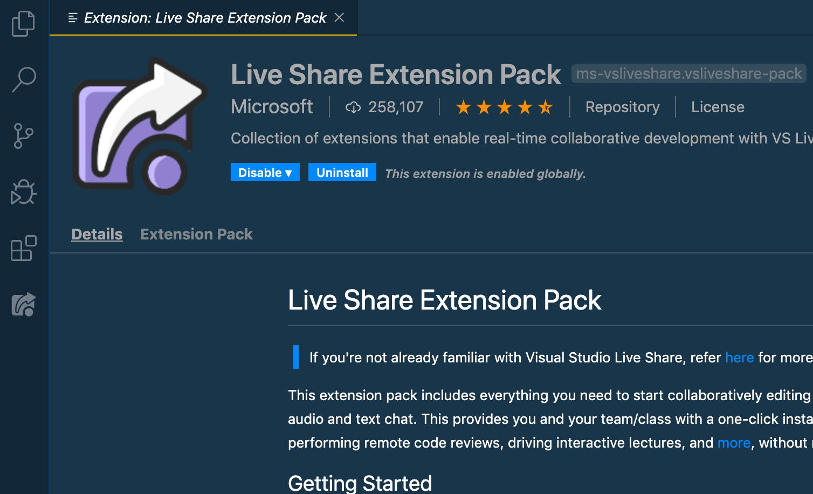

## How to use Visual Studio Live Share for remote coding sessions

Live Share enables you to quickly collaborate on the same codebase without the need to synchronize code or to configure the same development tools, settings, or environment.
When you share a collaborative session, your teammate sees the context of the workspace in their editor. This means your teammate can read the code you shared without having to clone a repo or install any dependencies your code relies on. 

### Setup
Install the [VS Code extension pack](https://marketplace.visualstudio.com/items?itemName=MS-vsliveshare.vsliveshare-pack) - a collection of extensions that enable real-time collaborative development with VS Live Share.
This extension pack includes everything you need to start collaboratively editing and debugging in real time, including integrated audio and text chat. 

### Start a collaboration session (read-only 👽)

Once the extension is installed, you will need to log in to the VS Live Share service. You can do that by opening the Command Palette Ctrl/Cmd + Shift + P and select “Sign In With Browser”. If you don’t log in and you try and start a new sharing session, you will be prompted to log in at that time. You can log in using your **GitHub** account.

There are several ways to kick off a new Live Share session. You can do it from the Command Palette, you can click that “Share” button in the bottom toolbar or you can use the VS Live Share explorer view in the Sidebar. 

Live Share offers the ability to share projects in read-only mode. As a host, when sharing, you have the option to enable read-only mode for a collaboration session.

If you select read-only, people will be able to see your code and follow your movements, but they will not be able to interact.

### Increase guest limit 

Since you probably are going to want more than that in read-only mode, especially if you’re teaching a group, you can up the limit to 30 by adding the following line to your User Settings.

`"liveshare.features": "experimental"`

### TBC

- Audio call   
- Share terminal  
- Slack integration  

[Live Share Website](https://visualstudio.microsoft.com/services/live-share/)  
[Install VS Code extension pack](https://marketplace.visualstudio.com/items?itemName=MS-vsliveshare.vsliveshare-pack)    
[Awesome resources for Visual Studio Live Share](https://github.com/vsls-contrib/awesome-liveshare)
